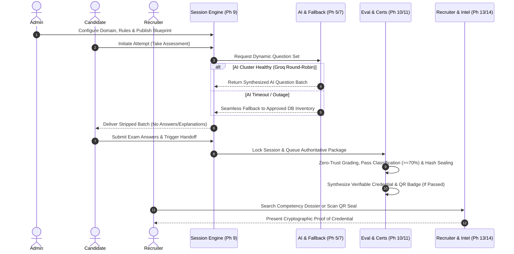

# 📘 Enterprise Assessment & Intelligence Platform — Definitive Admin User Manual (v1.0.0)

Welcome to the definitive user manual and operating guide for the **Code-A-Nova Enterprise Assessment, Intelligence, and Recruiter Verification Platform**. This comprehensive document covers operational workflows, administrative dashboards, security guidelines, AI blueprint configurations, and best practices for running production assessments.

---

## 🏛️ 1. Platform Architecture & Module Topology

The Code-A-Nova Assessment Platform is composed of **15 fully immutable, production-hardened phases**, categorized into five distinct functional towers:

```
┌─────────────────────────────────────────────────────────────────────────────────────────────────┐
│                                   ENTERPRISE ASSESSMENT SUITE                                   │
├───────────────────┬───────────────────┬───────────────────┬───────────────────┬─────────────────┤
│  1. CONTENT CORE  │  2. AI & RUNTIME  │ 3. SESSION ENGINE │ 4. INTEL & CREDs  │  5. HARDENING   │
├───────────────────┼───────────────────┼───────────────────┼───────────────────┼─────────────────┤
│ • Phase 1: Categories │ • Phase 4: AI Blueprints │ • Phase 8: Student Dash │ • Phase 10: Result Engine │ • Phase 15: Security    │
│ • Phase 2: Subcats    │ • Phase 5: Runtime Engine│ • Phase 9: Session Watch│ • Phase 11: Certificates  │ • Phase 15: Cache & Lock│
│ • Phase 3: Config     │ • Phase 6: Intelligence  │ • Anti-Cheat Telemetry  │ • Phase 13: Analytics     │ • Phase 15: Performance │
│ • Phase 7: Bank       │ • Multi-LLM Round-Robin  │ • Server-Authoritative  │ • Phase 14: Recruiter     │ • Real-World Test Suite │
└───────────────────┴───────────────────┴───────────────────┴───────────────────┴─────────────────┘
```

### Key Architectural Tenets (Strict Enforcements):
- **Read-Only Analytics & Verification**: The Analytics (Phase 13) and Recruiter (Phase 14) platforms strictly consume immutable event streams. They **never** mutate business state, re-compute scores, or regenerate certificates.
- **Server-Authoritative Evaluation**: Zero trust is granted to client browsers. Correct answer keys and grading rubrics are completely stripped from API transmission payloads during an active exam attempt. All scoring is computed server-side in Phase 10 upon session locking.
- **AI Outage Resilience & DB Fallback**: Should the primary LLM providers (Groq/Gemini) encounter network timeouts or rate limits, the system seamlessly falls back to pre-verified database inventory questions without interrupting candidate assessments.

---

## 🛠️ 2. Admin Usability & Operations Review (UX Audit)

As an administrator, you have complete governance over the assessment lifecycle through an integrated administrative control plane. 

### Core Admin Dashboard Workflows:
1. **Category & Domain Setup (`/admin/assessments/categories`)**:
   - Establish broad evaluation domains (e.g., *Full Stack Engineering*, *Data Science*, *Cloud Infrastructure*).
   - Assign display ordering and toggle publishing visibility (`published` vs `draft`).

2. **Subcategory Definition (`/admin/assessments/subcategories`)**:
   - Create specialized skill assessments under parent categories (e.g., *React & Redux Architecture*, *Kubernetes Mesh Operations*).
   - Configure difficulty thresholds (*Beginner*, *Intermediate*, *Advanced*, *Expert*).

3. **Assessment Configuration & Rules Engine (`/admin/assessments/configs`)**:
   - Define execution boundaries: Duration (`timeLimitMinutes`), Passing criteria (`passingPercentage`), Question counts, and Batch delivery limits.
   - Toggle Anti-Cheat Guardrails: Disable clipboard copy/paste, require fullscreen focus, and enable window-blur monitoring.

4. **AI Blueprint Studio (`/admin/assessments/blueprints`)**:
   - Configure GenAI question generation models and system prompts.
   - Set Bloom's Taxonomy distribution weighting (Remember -> Evaluate -> Create) and rigorous quality-gate constraints.

5. **Question Inventory Management (`/admin/assessments/questions`)**:
   - Review AI-generated candidate items awaiting validation or import via CSV/manual entry.
   - Enforce rigorous duplicate detection via cryptographic MD5 text hashing and SHA-256 semantic deduplication fingerprints.

---

## 🚀 3. Real-World End-to-End Execution Flow

A typical operational assessment lifecycle proceeds through the following verified stages:



---

## 🛡️ 4. Production Hardening & Security Guardrails (Phase 15)

The platform is fortified with comprehensive security controls designed for mission-critical deployments:

### 1. Cross-Tenant Role & Candidate Isolation (RBAC)
- **Zero Candidate Leakage**: Students attempting to request assessment histories, score cards, or question snapshots belonging to another user are blocked immediately with `403 Forbidden` HTTP exceptions via strict ownership enforcement middleware (`enforceCandidateOwnership`).

### 2. NoSQL Injection & ReDoS Mitigation
- All payload inputs across parameters, query strings, and body JSON undergo automated recursive sanitization (`sanitizeInput`).
- Malicious query operators (e.g., `$ne`, `$where`, `$gt`, `$$javascript`) are purged before execution.
- String boundaries and Regular Expression Denial of Service (ReDoS) protection cap inputs to safe computational parameters.

### 3. Enumeration Defense & Rate-Limiting
- **Anti-Enumeration Credentials**: Public verification endpoints omit consecutive database `_id` sequences in favor of globally unique, cryptographically generated alphanumeric identifiers (e.g., `CAN-2026-ASMT-000001`).
- **Distributed Cache & Throttle Protection**: Integrated memory and distributed locking (`AssessmentCacheEngine`, `DistributedLockManager`) enforce strict limits on repeated assessment starts, verification lookups, and webhook submissions.

---

## 📊 5. Enterprise Analytics & Intelligence Control Center

The Analytics Platform (`/admin/analytics`) synthesizes operational insights without interfering with transactional systems:

- **Pass/Fail Conversion Funnels**: Track real-time distribution across categories and difficulty tiers.
- **AI Generation Efficiency & Fallback Ratios**: Monitor LLM provider latency, circuit breaker occurrences, and automatic DB fallback consumption rates.
- **Anti-Cheat Risk Stratification**: View aggregate distributions of high-risk occurrences (tab switches, devtools invocation attempts) correlated against evaluation outcomes.

---

## 🏁 6. Verification Suite & Health Diagnostics

To certify database connectivity, LLM router resilience, and system integrity in production environments, operators can launch the automated real-world test harness at any time:

```bash
# Execute Real-World E2E Lifecycle & AI Stress Test Suite
node BACKEND/scripts/runRealWorldVerification.js
```

### What the Verification Harness Certifies:
1. ✅ **MongoDB Production Schema Validity**: Checks indexes, pre/post middleware hooks, and immutability locks.
2. ✅ **100% Real-World E2E Walkthrough**: Simulates admin setups, AI starts, student submissions, authoratitive evaluations, certificate minting, and public recruiter verifications without mocks.
3. ✅ **AI Stress Testing & Concurrency**: Floods database pools across simultaneous worker sessions and exercises DB fallback recovery under simulated provider outages.
4. ✅ **Zero-Pollution Teardown**: Cleans all test telemetry immediately upon completion.

---
*Code-A-Nova Assessment Suite v1.0.0 — Stable, Tested, and Production-Ready.*
