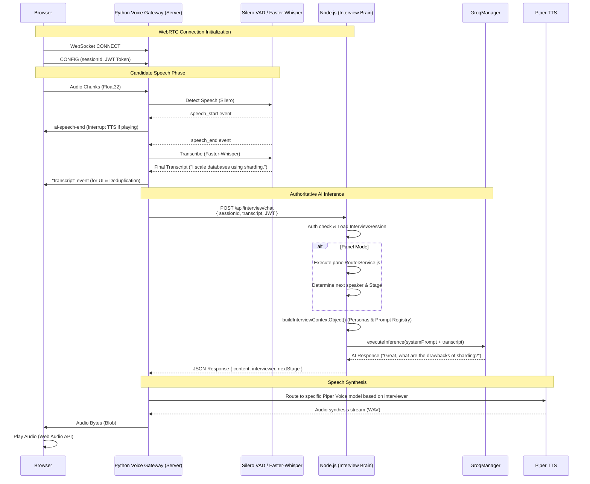

# Code-A-Nova Self-Hosted Voice Architecture

## Final Authoritative Data Flow

The migration from Vapi to a Self-Hosted Voice Stack ensures that the existing **Code-A-Nova Interview Brain (Node.js)** remains the authoritative Single Source of Truth for all logic, routing, scoring, and prompt building.

The Python Voice Gateway acts purely as an audio/WebRTC bridge.

## Security & State Ownership
1. **No Frontend Spoofing**: The frontend cannot spoof the `systemPrompt` or `interviewerName` by injecting it into the Voice Gateway. The gateway forwards only the `sessionId` and candidate transcript.
2. **Backend Authentication**: The Gateway uses the candidate's JWT Token to authorize the `POST /api/interview/chat` endpoint on the Node.js backend.
3. **Immutable History**: The Node.js backend maintains deterministic control over the interview flow and uses the centralized `GroqManager` for retry logic and key failover.
